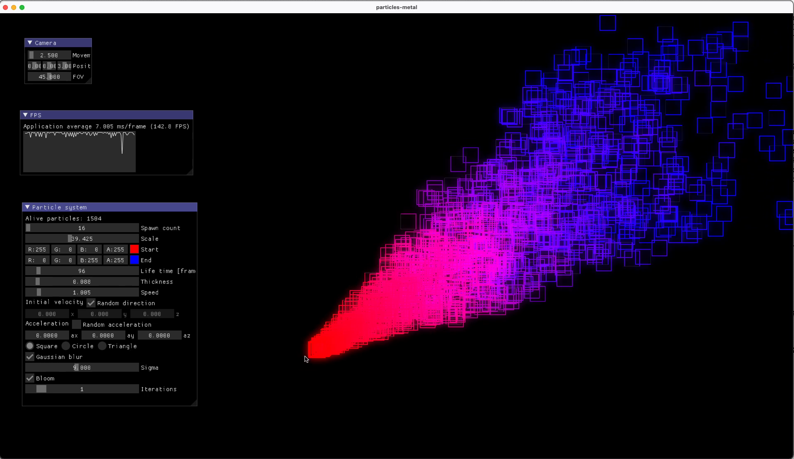

# particles-metal
Sandbox for toying with particles in Metal.

## Deps
```bash
git submodule update --init --recursive
```

## Build
```bash
mkdir build
cd build
cmake .. -G "Xcode"
cmake --build . --config Debug|Release
```

## Run
```bash
cd Debug|Release
./particles-metal
```


