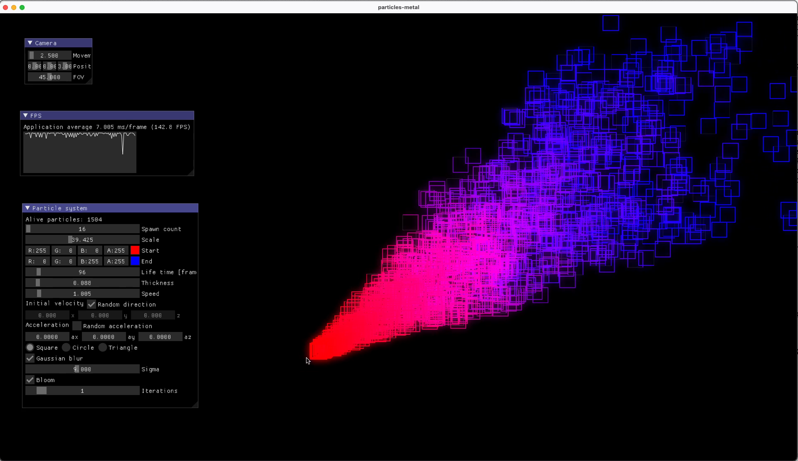
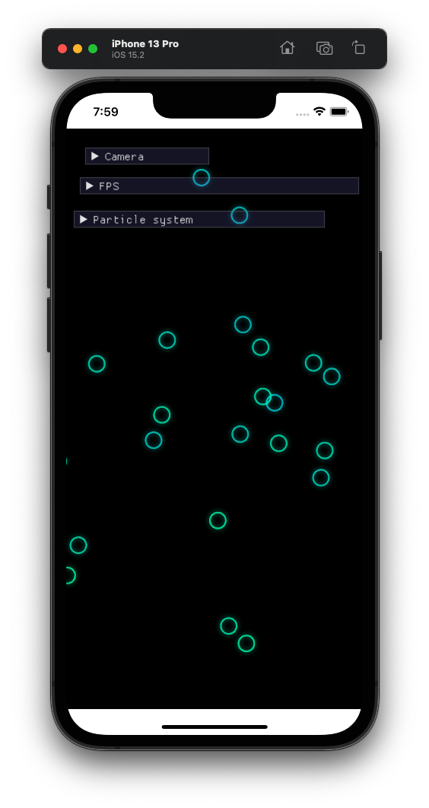

# particles-metal
Sandbox for toying with particles in Metal.

## Deps
```bash
git submodule update --init --recursive
```

## Build
```bash
mkdir build
cd build
```

### macOS
```bash
cmake .. -GXcode
cmake --build . --config Debug|Release
```

### iOS
Uses default CMake iOS toolchain.
```bash
cmake .. -GXcode -DCMAKE_SYSTEM_NAME=iOS
cmake --build . --config Debug|Release
```

### iOS-simulator
Uses default CMake iOS toolchain.
```bash
cmake .. -GXcode -DCMAKE_SYSTEM_NAME=iOS
cmake --build . --config Debug|Release -- -sdk iphonesimulator
```

## Run
macOS and iOS-simulator can be built from command line.
For iOS:
1. open the project
    ```bash
    cd build
    cmake --open .
    ```
2. Set development team
3. Build and run

**In case of issues it might be a good idea to import sources to XCode-generated project, build to see if the issue still exists. If it does then compare project properties and set them accordingly in CMakeLists.txt using `set_target_properties` and `XCODE_ATTRIBUTE_{name}`.**

# Output



